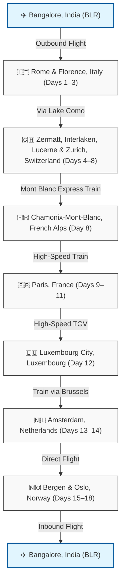

# 🇪🇺 The Optimized 19-Day European Escape
## A 19-Day Door-to-Door Itinerary: Bangalore (BLR) to Bangalore (BLR)
### Visa Embassy: Switzerland (Longest Stay Tie-Breaker: 4 Nights, Entered First)

This itinerary is structured for **exactly 19 days door-to-door**, starting in Rome, Italy and concluding in Oslo, Norway. It includes Chamonix-Mont-Blanc (French Alps), Zermatt (Matterhorn), Interlaken, Lauterbrunnen, Lucerne, Luxembourg, Amsterdam, and Norway's fjords at a highly optimized pace.

---

### 🗺️ Route Flow (19 Days)



#### 📍 Text-Based Route Flow (Fallback)
```text
✈️ Bangalore, India (BLR)
   │ 
   │ (Outbound Flight via Middle East - Lands early Day 1)
   ▼
🇮🇹 Italy: Rome & Florence [Days 1–3]
   │ 
   │ (Early Train & Lake Como day-transit)
   ▼
🇨🇭 Switzerland: Zermatt, Interlaken, Lucerne & Zurich [Days 4–8]
   │ 
   │ (Mont Blanc Express / Martigny Train: 4h 00m)
   ▼
🇫🇷 French Alps: Chamonix-Mont-Blanc [Day 8]
   │ 
   │ (High-Speed TGV Train: 4h 45m)
   ▼
🇫🇷 France: Paris [Days 9–11]
   │ 
   │ (TGV Train: 2h 10m)
   ▼
🇱🇺 Luxembourg: Luxembourg City [Day 12]
   │ 
   │ (Intercity Train via Brussels: 5h 30m)
   ▼
🇳🇱 Netherlands: Amsterdam [Days 13–14]
   │ 
   │ (Direct Flight: 1h 45m)
   ▼
🇳🇴 Norway: Bergen & Oslo [Days 15–18]
   │ 
   │ (Inbound Flight via Middle East - Lands Day 19)
   ▼
✈️ Bangalore, India (BLR)
```

---

### 📅 Daily Schedule

| Day | Location | Highlights & Key Sights | Transit & Logistics |
| :--- | :--- | :--- | :--- |
| **Day 1** | Rome, Italy | Arrive in Rome (morning). Visit Colosseum, Roman Forum, Palatine Hill & Altar of the Fatherland. Evening walk to Trevi Fountain & Pantheon. | Flight: BLR → FCO (Lands by 09:00 AM) |
| **Day 2** | Rome → Florence | Vatican Museums, Sistine Chapel, St. Peter's Basilica & Castel Sant'Angelo. Evening high-speed train to Florence. | Frecciarossa Train (1h 35m, departure ~18:30) |
| **Day 3** | Florence, Italy | Morning Uffizi & Accademia (David). Afternoon visit to Duomo, Ponte Vecchio & Palazzo Vecchio. Sunset at Piazzale Michelangelo. | Walking |
| **Day 4** | Florence → Lake Como → Zermatt | Early morning train to Milan/Varenna. Spend 4 hours at Lake Como (Bellagio/Varenna). Afternoon scenic train to Zermatt. | Train & Ferry (highly optimized single-day transit - see details at end) |
| **Day 5** | Zermatt → Interlaken | Gornergrat Cogwheel Railway for Matterhorn views. Afternoon train to Interlaken; cruise on Lake Brienz. | Swiss Rail (2h 10m) |
| **Day 6** | Interlaken & Alps | Day trip to Jungfraujoch (Top of Europe) and explore Lauterbrunnen waterfalls & Grindelwald First. | Mountain Cogwheel Trains |
| **Day 7** | Interlaken → Lucerne | Luzern-Interlaken Express scenic train. Mt. Pilatus Golden Round Trip (cable car & boat). Chapel Bridge. | Scenic Train (2h) + Boat & Cable Car |
| **Day 8** | Lucerne → Zurich → Chamonix | Morning train to Zurich (45m); walk Zurich Altstadt & Lake. Early afternoon train to Chamonix (via Martigny / Mont Blanc Express). | Train (Zurich-Chamonix: ~4h, departure ~13:00) |
| **Day 9** | Chamonix → Paris | Morning ride on Aiguille du Midi cable car (closest view of Mont Blanc). Afternoon TGV train to Paris. Evening Seine Cruise. | Cable Car + TGV Train (4h 45m, departure ~13:30) |
| **Day 10** | Paris, France | Louvre Museum, Tuileries Gardens, Left Bank walking tour, Notre-Dame Cathedral, and Montmartre/Sacré-Cœur at sunset. | Paris Metro |
| **Day 11** | Paris, France | Day trip to Loire Valley Châteaux (Chambord or Chenonceau). Return to Paris for evening Marais district shopping & walk. | TGV Train / Tours (1h to Tours/Blois) |
| **Day 12** | Paris → Luxembourg | Morning TGV to Luxembourg. Walk UNESCO Old Quarter, Casemates du Bock, Chemin de la Corniche. | TGV Train (2h 10m, departure ~09:40) |
| **Day 13** | Luxembourg → Amsterdam | Morning train to Amsterdam. Arrive afternoon; explore canal ring & Jordaan. | Intercity Train via Brussels (5h 30m) |
| **Day 14** | Amsterdam, Netherlands | Rijksmuseum, Anne Frank House, classic evening boat cruise. | Walking / Tram |
| **Day 15** | Amsterdam → Bergen | Morning trip to Zaanse Schans windmills; evening flight to Bergen, Norway. | Flight: AMS → BGO (Direct: 1h 45m) |
| **Day 16** | Bergen, Norway | Bryggen Wharf, Mount Fløyen Funicular, Fish Market. | Walking |
| **Day 17** | Bergen → Flåm → Oslo | Nærøyfjord cruise to Gudvangen, bus to Voss, train to Oslo. | Boat & Train ("Norway in a Nutshell") |
| **Day 18** | Oslo, Norway | Vigeland Sculpture Park, Fram Museum; evening departure to Bangalore. | Flight: OSL → BLR (1-stop via Middle East) |
| **Day 19** | Bangalore, India | Arrive back in Bangalore. | Flight landing |

---

### 🛂 Visa Strategy (Switzerland Embassy - Tie-Breaker)

> [!IMPORTANT]
> **Visa Application Details**:
> * **Embassy**: Switzerland Embassy (via VFS Global Bangalore).
> * **Stays**: Switzerland (4 nights), France (4 nights - 1 Chamonix, 3 Paris). 
> * **First Entry**: Italy (Rome FCO).
> * Under Schengen rules, when your stays in the longest-stay countries are tied (4 nights each for Switzerland and France), you must apply to the one you **enter first**. Since you enter Switzerland (Day 4) before France (Day 8), Switzerland is the correct visa authority.

---

### 💳 Approximate 19-Day Budget (Per Person in USD)
*(Reflects $0 Norway accommodation, meals with family, and reduced local transit)*

| Category | Boutique / Moderate | Luxury |
| :--- | :--- | :--- |
| **Accommodation** (14 Nights Paid) | $2,050 – $2,700 | $4,700 – $6,400 |
| **Transport** (Trains, Flights, Passes) | $950 – $1,250 | $1,900 – $2,600 |
| **Food & Dining** | $1,100 – $1,550 | $2,400 – $3,500 |
| **Activities & Entry Tickets** | $650 – $950 | $1,600 – $2,500 |
| **Total Estimated Cost** | **$4,750 – $6,450** | **$10,600 – $15,000+** |

---

### 👭 Joint Budget for 2 Travelers (Total in USD)
*(Assumes 2 girls sharing a double hotel room/cabin, splitting lodging costs)*

| Category | Boutique / Moderate (Total) | Luxury (Total) |
| :--- | :--- | :--- |
| **Accommodation** (1 Room shared) | $2,050 – $2,700 | $4,700 – $6,400 |
| **Transport** (Flights & trains for 2) | $1,900 – $2,500 | $3,800 – $5,200 |
| **Food & Dining** (For 2) | $2,200 – $3,100 | $4,800 – $7,000 |
| **Activities & Tickets** (For 2) | $1,300 – $1,900 | $3,200 – $5,000 |
| **Total Joint Trip Cost** | **$7,450 – $10,200** | **$16,500 – $23,600+** |
| *Per Person Equivalent* | *$3,725 – $5,100* | *$8,250 – $11,800* |

---

### ⏱️ Day 4: Detailed Hour-by-Hour Transit (Florence ➔ Lake Como ➔ Zermatt)
This highly optimized schedule allows you to experience the beauty of Lake Como (Varenna & Bellagio) on your way from Florence to Zermatt in a single day. 

> [!IMPORTANT]
> **Luggage Strategy**: Do not carry heavy luggage to the lake. Use the **KiPoint Luggage Deposit** at Milan Central Station (Platform 21 level) to store your bags during the day-trip.

| Time | Activity | Logistics & Details |
| :--- | :--- | :--- |
| **06:00 AM – 07:45 AM** | **Florence to Milan** | High-speed Frecciarossa train from *Firenze SMN* to *Milano Centrale*. |
| **07:45 AM – 08:10 AM** | **Luggage Drop-off** | Deposit heavy bags at **KiPoint** (near Platform 21) in Milan Central. Travel light with just daypacks. |
| **08:20 AM – 09:23 AM** | **Milan to Lake Como** | Regional train to **Varenna-Esino** (sit on the left side for lake views). |
| **09:30 AM – 09:50 AM** | **Ferry to Bellagio** | Walk 10 mins downhill to the Varenna dock, buy round-trip ferry tickets to **Bellagio**. |
| **10:05 AM – 12:30 PM** | **Bellagio & Lunch** | Explore Bellagio's scenic alleys and enjoy an early lakeside lunch. |
| **12:45 PM – 13:00 PM** | **Ferry to Varenna** | Take the ferry back to Varenna. |
| **13:00 PM – 13:20 PM** | **Varenna Stroll** | Walk along Varenna's romantic lakeside path (*Passeggiata dell'Amore*). |
| **13:20 PM – 13:35 PM** | **Return to Station** | Walk back up to Varenna-Esino station. |
| **13:35 PM – 14:40 PM** | **Varenna to Milan** | Regional train back to *Milano Centrale*. |
| **14:40 PM – 15:05 PM** | **Retrieve Luggage** | Collect your heavy bags from KiPoint and buy snacks/water for the Swiss train. |
| **15:20 PM – 17:30 PM** | **Milan to Visp (Swiss)** | Eurocity (EC) train from Milan to **Visp** (Simplon route). *Book in advance!* |
| **17:40 PM – 18:51 PM** | **Visp to Zermatt** | Transfer to the **Matterhorn Gotthard Bahn** cogwheel train to Zermatt (covered by Swiss Travel Pass). |
| **19:00 PM** | **Arrive in Zermatt** | Check-in, enjoy the evening views of the Matterhorn, and have dinner. |
